# Discovery Loop

Discovery Loop is a durable, interactive fog-of-war process for turning a
vague idea into understood, prioritized, and dependency-aware units of work.
It operates in repeatable cycles, persists its understanding outside the
conversation, and resumes each cycle from the latest durable state.

> **Status:** This document describes the target hardened design. The current
> runtime workflow remains defined by [SKILL.md](./SKILL.md) and its references
> until the hardening changes are implemented.

## Core Model

Every discovery session is grounded in one central idea or file. The root
begins vague and foggy. Each cycle expands and clarifies the tree until its
leaves are sufficiently understood to synthesize a meaningful backlog.
The root also maintains the session's canonical Domain Lexicon so every branch
uses the same language.

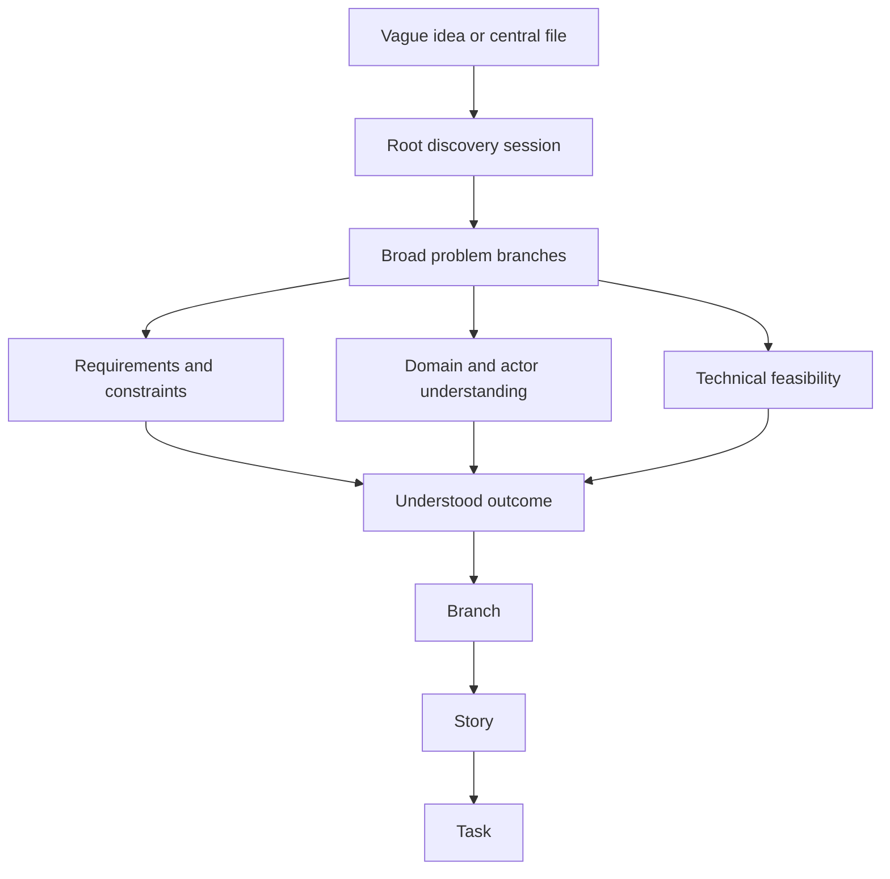

The durable structure is a rooted tree with typed graph links. Parent-child
links preserve decomposition. Cross-links represent dependencies, shared
evidence, conflicts, related domains, and relationships to other discovery
sessions.

## Cyclic Execution

Each cycle must leave the durable discovery state richer or more accurate than
it found it. Growth can mean adding nodes, splitting an oversized node,
strengthening evidence, resolving a question, merging duplicates, invalidating
an assumption, or promoting a ready subtree.

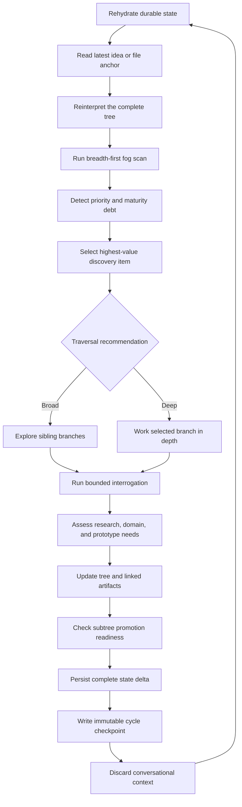

The persisted artifacts, not the prior conversation, are authoritative. After
every persist step, the loop compresses the completed cycle, discards working
context, and starts the next cycle by rereading current state.

## Fog States

The active frontier is the boundary between sufficiently understood territory
and unresolved fog.

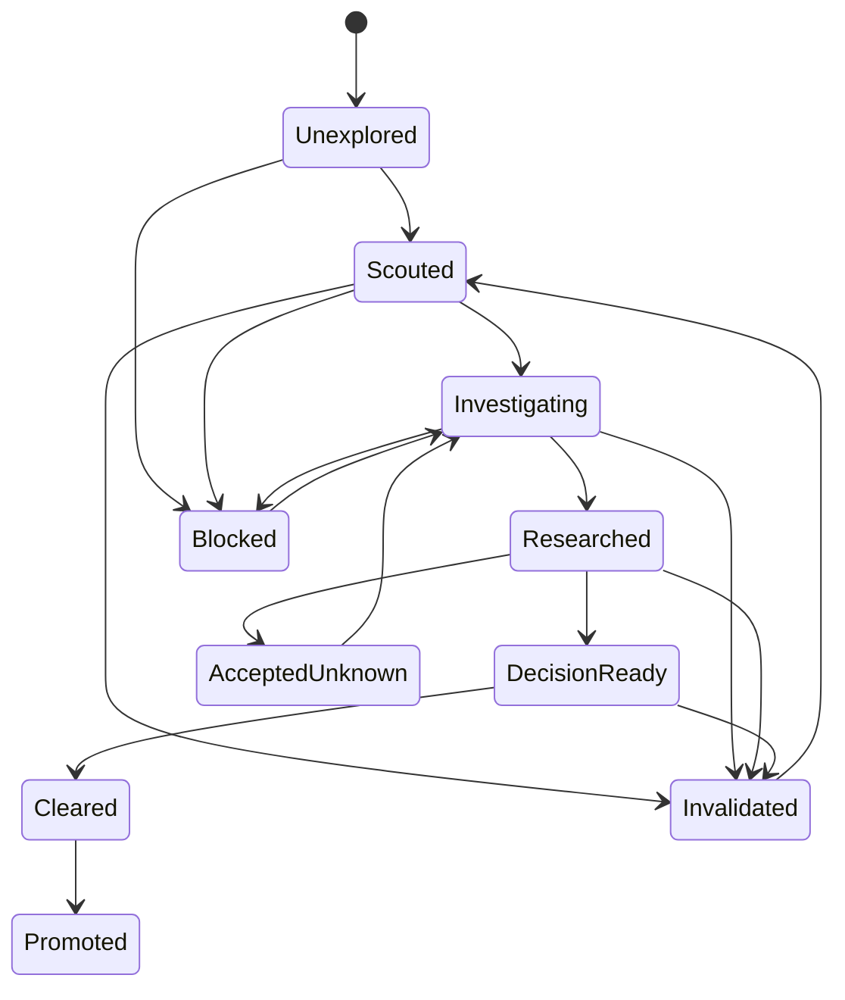

Each node also records its priority, evidence, requirements, decisions,
dependencies, verification seam, and the anchor revision against which it was
last interpreted.

## Adaptive Breadth and Depth

Breadth-first discovery is the default. It exposes the shape of the problem,
allows meaningful priority comparison, and avoids committing too early to one
branch.

The loop switches to bounded depth-first work when it detects priority debt,
a shared blocker, high risk, major uncertainty, or a branch that unlocks
substantial downstream work.

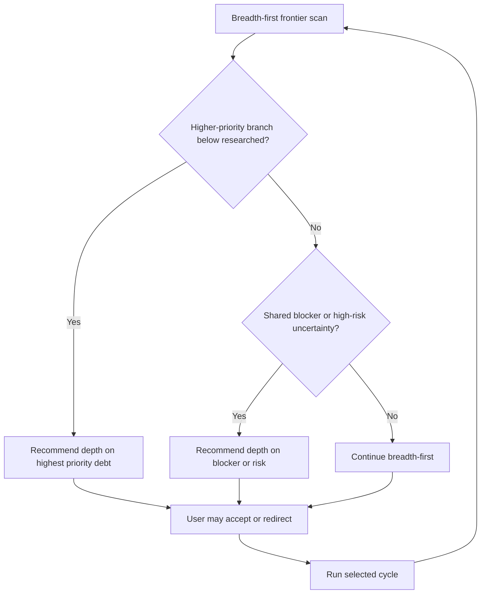

Priority and maturity are independent:

```text
Priority: unprioritized, P2, P1, P0
Maturity: vague, framed, researched, decision-ready, promotion-ready
```

A lower-priority branch must not continue gaining depth while a related
higher-priority branch remains below `researched`. The researched floor means
that the problem, intended outcome, evidence, blockers, and next decisions are
known. The higher-priority branch does not need to be completely cleared before
breadth-first work resumes.

At the beginning of each cycle, the loop states either:

- "We're going to go broad on this topic first"; or
- "I recommend we go deep on `<topic>`."

The user can redirect the selected branch or traversal mode. Otherwise, the
loop proceeds with its best recommendation.

## Interrogation Groups

Every cycle focuses on one highest-value discovery item and asks questions one
at a time. Each question includes:

1. the recommended answer and a brief rationale;
2. one credible alternative and its tradeoff;
3. freeform user entry.

The question-group size is configurable per session and overridable per
invocation. The default is 12.

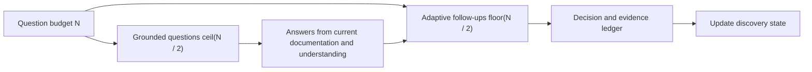

Examples:

| Invocation | Grounded questions | Follow-ups | Maximum |
| --- | ---: | ---: | ---: |
| `/discovery-loop in groups of 5` | 3 | 2 | 5 |
| Default session | 6 | 6 | 12 |
| `/discovery-loop in groups of 35` | 18 | 17 | 35 |

Grounded questions come directly from the latest anchor, tree, domain model,
requirements, evidence, linked sessions, and promoted tickets. They are framed
to clear known fog.

Follow-up questions adapt to the first-half answers. They clarify intent,
request details or source material, reconcile contradictions, and expose
constraints, dependencies, feasibility concerns, and verification needs.
Unused follow-up capacity is not filled merely to reach the maximum.

When the group ends, the loop records decisions and unresolved fog, persists a
checkpoint, discards context, and restarts. It never exceeds the configured
question budget in one cycle.

## Root Discovery Layer

The discovery workspace is grounded in one product, application, platform, or
system being built. Its primary mind map is the low-resolution model of that
whole product. Discovery sessions are focused vertical explorations beneath
that map. They clarify one product area deeply and feed their current
understanding back into the product-level view.

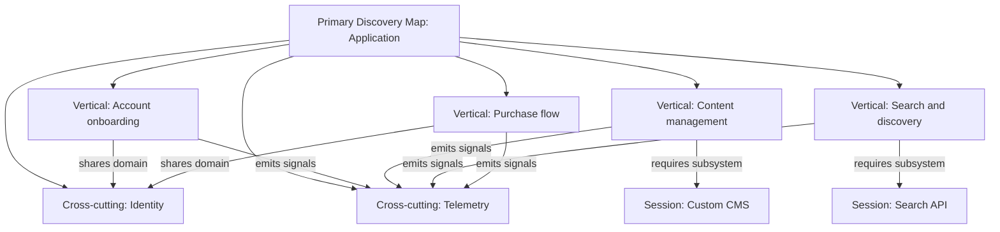

The primary map contains:

- the whole-product idea, Destination, and success conditions;
- major user and system verticals;
- cross-cutting domains and constraints;
- shared actors and canonical language;
- relationships and dependencies between verticals;
- each vertical's priority, maturity, active fog, and major blockers;
- links to the detailed discovery session for each explored vertical.

Each discovery session is anchored to one node or bounded branch of the primary
map. It owns the detailed tree, questions, requirements, evidence, domain
model, and backlog candidates for that vertical. Its cycle checkpoint updates
the corresponding primary-map node with a compact status and summary.

Typed cross-session edges include:

- `requires-session`;
- `informs-session`;
- `conflicts-with-session`;
- `shares-domain-with`;
- `constrains-session`;
- `supersedes-session`;
- `related-session`.

The primary map is the entry point for deciding which vertical has the highest
discovery value. A session cycle loads the low-resolution product map and the
full current state of only the selected vertical. It reads linked session
summaries or specific nodes on demand rather than loading every detailed tree.

The direction of synthesis is bidirectional:

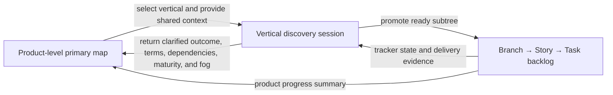

The primary map must remain concise. It tells the team what the application is,
which verticals exist, how they relate, and where fog remains. Detailed
requirements, interrogation history, research, and decomposition stay inside
the owning vertical session.

### Shared Domain Lexicon

The root discovery layer maintains a running tally of domain terms shared
across discovery efforts. Each session also maintains a scoped lexicon in its
own `discovery.md`. These compact lexicons are loaded before branch selection
and question generation so the loop remains crisp and consistent in its
language.

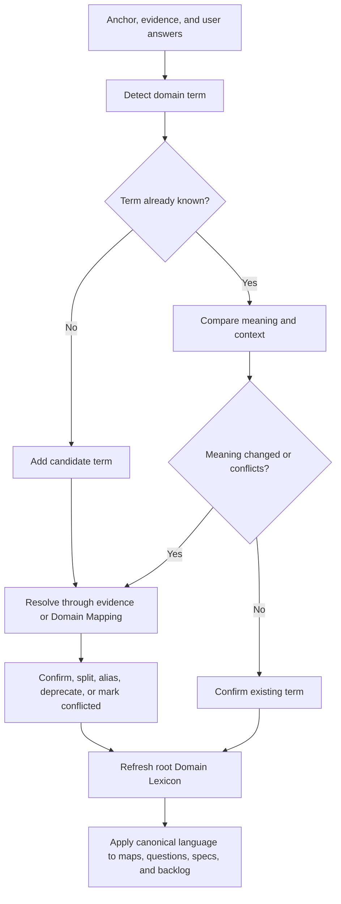

Each shared or session-scoped entry records:

| Field | Purpose |
| --- | --- |
| Term | Canonical spelling used by the session |
| Status | `candidate`, `confirmed`, `conflicted`, or `deprecated` |
| Definition | One concise, testable meaning |
| Bounded context | Where the definition applies |
| Aliases | Accepted synonyms and discouraged variants |
| Source | Evidence, decision, or domain artifact supporting the meaning |
| First seen | Node and cycle that introduced the term |
| Last verified | Latest cycle that checked the term |
| Related terms | Parent, child, contrasting, or associated concepts |

The shared root tally is a compact operating lexicon, not a replacement for a
session's `domain-model.md`. The domain model owns detailed actors, entities,
lifecycle, boundaries, ownership, and relationships. The root lexicon contains
only canonical terms needed across discovery efforts. A session lexicon
contains terms needed to interpret that session's detailed map consistently.

Every cycle must:

1. load the primary mind map, shared lexicon, and selected session lexicon
   before reading branch text;
2. detect undefined, overloaded, conflicting, or drifting language in the
   anchor, tree, evidence, and answers;
3. use existing confirmed terms in questions and recommendations;
4. add new language as `candidate`, never silently as confirmed;
5. invoke Domain Mapping when a term materially affects scope, ownership,
   lifecycle, requirements, architecture, or decomposition;
6. propagate a confirmed rename or definition change to affected current-state
   artifacts while preserving historical wording in cycle checkpoints;
7. include unresolved terminology as fog that can block branch promotion.

Terms first defined in one session retain their source-session identity. A term
used by multiple sessions is proposed for promotion into the shared lexicon. A
local session can adopt an alias or context-specific definition, but it must
record the distinction instead of silently redefining the shared term.

## Research and Prototypes

Before framing grounded questions, the loop inspects available evidence. For
the selected node, it distinguishes:

- facts answerable from repository or documentation evidence;
- user or product decisions;
- domain-modeling questions;
- technical feasibility research;
- questions requiring a bounded prototype;
- accepted unknowns.

Read-only research can run through bounded subagents. A prototype requires
explicit approval and must define a hypothesis, time or cost budget, isolation
boundary, cleanup plan, and evidence output. Prototype work must not silently
become production implementation.

## Multiple Discovery Sessions

One discovery session covers one anchored major idea. A workspace can contain
multiple sessions connected as a knowledge graph.

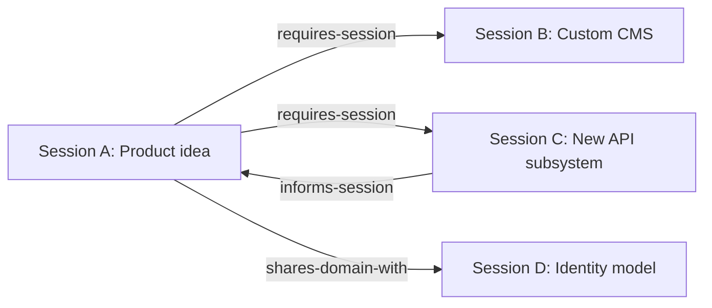

A branch is extracted into a separate session only when it represents a major
concept with an independent problem, outcome, domain, architecture surface,
multi-branch backlog, or delivery boundary. Examples include a custom content
management system or a new application programming interface subsystem.

The loop proposes extraction and explains why. The user must approve it.
Ordinary features, requirements, and technical tasks remain in their parent
session.

## Session Package

The root discovery layer stores the primary mind map and shared lexicon. Each
session stores compact current state separately from immutable historical
checkpoints.

```text
docs/discovery/
├── discovery-map.md
├── domain-lexicon.md
└── sessions/
    └── <destination>/
        ├── discovery.md
        ├── domain-model.md
        ├── requirements.md
        ├── evidence.md
        └── cycles/
            └── <cycle-id>.md
```

- `discovery-map.md` is the primary low-resolution mind map connecting all
  discovery sessions, their priorities, maturity, blockers, and typed links.
- `domain-lexicon.md` is the running tally of canonical terms shared across
  discovery sessions.
- `discovery.md` contains the anchor, current tree, active frontier, priorities,
  maturity, blockers, session-scoped Domain Lexicon, and tracker
  synchronization state.
- `domain-model.md` contains current vocabulary, actors, boundaries, ownership,
  lifecycle understanding, and detailed relationships behind the root lexicon.
- `requirements.md` contains confirmed requirements, constraints, exclusions,
  and unresolved requirements.
- `evidence.md` indexes sources, research results, prototypes, limitations, and
  evidence hashes.
- `cycles/<cycle-id>.md` is an immutable compressed checkpoint.

If the session is anchored in another Markdown file, `discovery.md` links to
that file and records its current revision. Every cycle reinterprets the full
tree from the latest anchor content while preserving prior conclusions as
history.

## Promotion into the Backlog

Markdown is the incubation layer. Speculative fog stays out of the ticketing
system. A ready subtree is promoted only after a complete preview and explicit
approval.

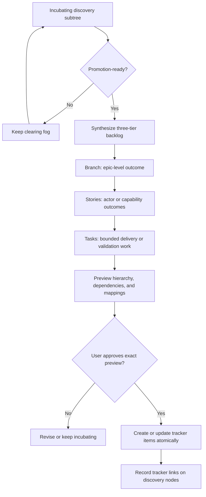

The canonical semantic hierarchy is:

```text
Branch
└── Story
    └── Task
```

These are semantic tiers, not hard-coded provider work-item types. The
repository tracker contract maps them to the available native hierarchy.

A promotion-ready leaf has:

- one bounded observable outcome;
- explicit scope and exclusions;
- actors and value;
- confirmed requirements and applicable non-functional constraints;
- priority and rationale;
- dependencies and blockers;
- a technical-feasibility disposition;
- evidence and accepted unknowns;
- a verification seam;
- enough clarity to create work without inventing facts.

Deeper conceptual nodes are folded into branch or story context. Dependencies
remain explicit. Unresolved fog is never disguised as an implementation task.

## Daily Repeatability

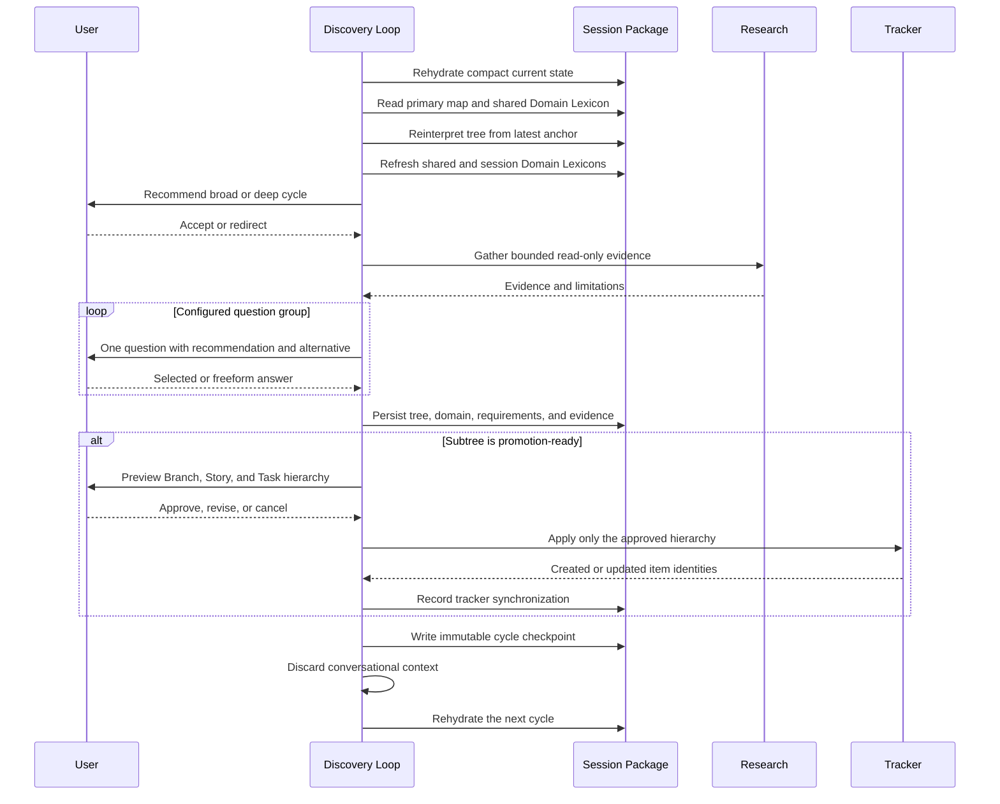

A daily pause completes the current persistence step, records incomplete
research and unanswered questions, saves priority debt and the deterministic
next frontier, and emits a concise resume instruction. Pausing a run does not
mean the discovery session is complete.

## Required Invariants

1. Every node traces back to one session anchor.
2. Every cycle rereads durable state before acting.
3. Every cycle produces a persisted state delta or an explicit no-change
   outcome.
4. Conversation memory is never the canonical state.
5. Lower-priority depth cannot outrun related higher-priority understanding.
6. Question groups never exceed their configured maximum.
7. Research evidence never settles a user-owned decision.
8. Subagents never mutate discovery, domain, specification, or tracker state.
9. Prototypes require explicit approval and remain disposable.
10. Major-session extraction requires explicit approval.
11. Backlog publication requires an exact hierarchy preview and approval.
12. Tracker mappings preserve discovery-node identity and provenance.
13. Anchor changes invalidate only conclusions that reinterpretation proves
    affected.
14. Unresolved fog is never represented as completed understanding or
    implementation work.
15. Every branch uses the root Domain Lexicon or records an explicit
    context-specific distinction.
16. New or changed domain language remains candidate or conflicted until
    evidence or a user-owned decision confirms it.
17. Every discovery session appears exactly once on the primary mind map.
18. Cross-session dependencies and knowledge relationships use typed links.
19. A session cycle loads only the relevant detailed session state, not every
    connected session tree.

## Related Workflow Contracts

- [Skill entry point](./SKILL.md)
- [Composition and ownership](./references/10-composition-and-ownership.md)
- [Current loop workflow](./references/20-loop-workflow.md)
- [Shared Understanding format](./references/30-shared-understanding-format.md)
- [Delegation and concurrency](./references/40-delegation-and-concurrency.md)
- [Safeguards and recovery](./references/50-safeguards-and-error-recovery.md)
- [Examples and scenario tests](./references/60-examples-and-scenario-tests.md)
