# Discovery Loop

Discovery Loop is a durable, interactive fog-of-war process for turning a
vague idea into understood, prioritized, and dependency-aware units of work.
It operates in repeatable cycles, persists its understanding outside the
conversation, and resumes each cycle from the latest durable state.

> **Status and authority:** This document explains the design: why the loop
> exists, what it guarantees, and what its vocabulary means. It is not the
> runtime script and is not read in full before every cycle.
> [SKILL.md](./SKILL.md) and its references are the runtime contract and win on
> execution detail - ordering, schemas, digests, gates, and status codes. This
> document wins on design intent. Either way, a disagreement is reported rather
> than silently resolved.

## Intended Readers

| Artifact | Intended reader | Purpose |
| --- | --- | --- |
| `README.md` | A human evaluating, adopting, or reviewing the package | Design intent, model, vocabulary, and guarantees |
| `SKILL.md` | The agent starting an invocation | Routing, tool posture, reference loading order, and the cycle outline |
| `references/10`-`references/60`, `references/90` | The agent executing every cycle | Mandatory execution contract |
| `references/70`, `references/80`, `references/95` | The agent entering a specific phase | On-demand contract for research, promotion, and worked examples |

## Vocabulary

These terms are used precisely throughout the package.

| Term | Meaning |
| --- | --- |
| Anchor | The one idea statement or file a session is grounded in. Every node traces back to it, and every cycle reinterprets the tree against its current revision. |
| Anchor revision | The identifier of the anchor content the cycle read: a commit, a content hash, or an ISO-8601 timestamp. |
| Destination | The end state the session is trying to reach, written as observable success conditions rather than activities. |
| Fog | Unresolved understanding attached to a node: an open question, an unverified assumption, a blocker, or an unmodeled boundary. Also the name of the node's lifecycle state. |
| Frontier | The current boundary between sufficiently understood territory and remaining fog: every node that is neither `cleared` nor `promoted`. |
| Vertical | One user-facing or system-facing slice of the product that a single discovery session explores in depth, shown as one node on the primary map. |
| Cross-cutting domain | A concern several verticals share, such as identity or telemetry, tracked on the primary map rather than owned by one vertical. |
| Verification seam | The named, observable place where the outcome can be checked - a test, a metric, a log, a contract assertion, or a manual acceptance step - stated before work is promoted. |
| Node | One unit of understanding in a session tree, with its own identity, fog, maturity, priority, evidence, and history. |
| Cycle | One pass of the loop: one question group, one staged update, one gate evaluation, one checkpoint, one context reset. |
| Journal | The append-only working file for the in-flight cycle. It makes an interrupted cycle resumable without re-asking answered questions. |
| Checkpoint | The immutable record of a completed cycle. Current state changes; checkpoints never do. |
| Promotion | Publishing a ready subtree into the issue tracker as a Branch-Story-Task hierarchy after an exact preview approval. |
| Promotion key | The immutable identity written into a tracker item so re-promotion updates it instead of duplicating it. |
| Branch (semantic tier) | The top tier of a promoted hierarchy - an epic-level outcome for one bounded area - mapped to a provider work-item type through the approved tier map. Always written "Branch tier" when the surrounding text also discusses tree branches. |
| Branch (discovery tree) | A non-leaf node in a session tree and everything beneath it. It is a shape in the tree, not a tracker tier, and it is what the promotion gate calls the branch node of a subtree. |
| Leaf | A node with no children: the unit that passes or fails the leaf half of the promotion gate and becomes a Story or Task. |
| Subtree | One branch node plus all of its descendants, evaluated together by the promotion gate and previewed together. |
| Domain handoff key | The deterministic identity `<session>/<cycle>/<packet-digest>` of one Domain Mapping handoff, so a resumed cycle can tell a completed handoff from one that must be reconciled. |
| Pending checkpoint candidate | The rendered but unpublished checkpoint at `cycles/.pending/<cycle-id>.<run-id>.md`. It becomes the immutable checkpoint only by an atomic rename after the state it describes has verified. |
| Digest-control block | The six frontmatter fields the loop writes about its own bookkeeping. They are normalized out of the state digest so the digest describes content, not bookkeeping. |
| Material | The threshold that decides when the loop escalates to a gate, a composed skill, or a blocking status. Defined normatively in [Safeguards and recovery](./references/90-safeguards-and-recovery.md). |
| Architecture Decision Record (ADR) | A durable record of one consequential design decision, its context, and its consequences. `/domain-mapping` owns any ADR this loop's vocabulary work qualifies for. |

## Core Model

Every discovery session is grounded in one central idea or file. The root
begins vague and foggy. Each cycle expands and clarifies the tree until its
leaves are sufficiently understood to synthesize a meaningful backlog.
The root also maintains the session's canonical Domain Lexicon so every branch
uses the same language.

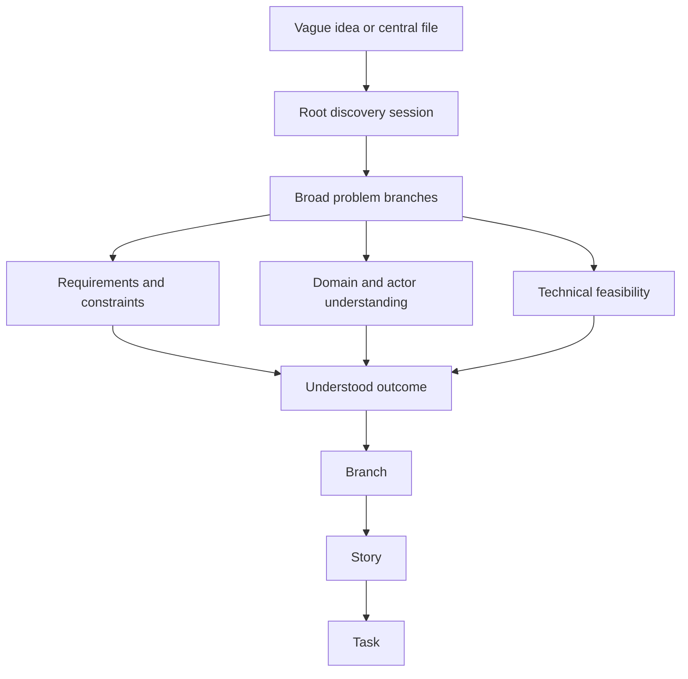

The durable structure is a rooted tree with typed graph links. Parent-child
links preserve decomposition. Cross-links represent dependencies, shared
evidence, conflicts, related domains, and relationships to other discovery
sessions.

## Cyclic Execution

Each cycle must leave the durable discovery state richer or more accurate than
it found it. Growth can mean adding nodes, splitting an oversized node,
strengthening evidence, resolving a question, merging duplicates, invalidating
an assumption, or promoting a ready subtree.

The cycle stages every change first, confirms the durable state has not moved
underneath it, hands any confirmed domain change to its owning skill, runs the
promotion gate, and only then writes. One step - the persist step - is the sole
writer of discovery state: the session current-state files, tracker
synchronization, the root map, the shared lexicon, and the checkpoint.

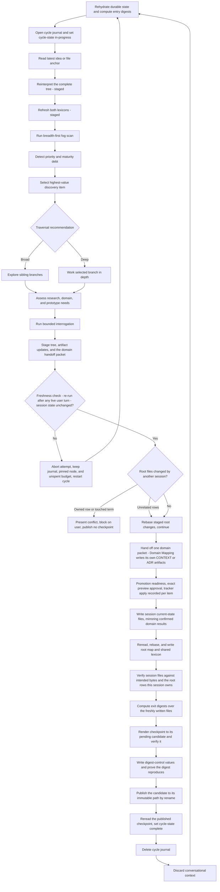

The persisted artifacts, not the prior conversation, are authoritative. After
every persist step, the loop compresses the completed cycle, discards working
context, and starts the next cycle by rereading current state. A checkpoint is
never immutable before the state it describes is verified: it is rendered to a
pending candidate, checked, and published by an atomic rename as the last write
of the cycle. Five cases publish no checkpoint - an attempt aborted because the
session's own state moved underneath it, which keeps its journal, its cycle id,
its pinned node, and its unspent question budget and restarts; a root conflict
on content this session owns, which stops before any mutation and asks the
user; a restarted attempt whose pinned node came back invalidated or orphaned,
which waits for the user to say what that node should become; a cycle that
cannot detect drift at all, which runs strictly read-only; and a cycle that
fails before persist finishes, which keeps its journal and any pending
candidate for recovery. Aborting applies to session state only: a
change to the shared root files by another session is rebased and the cycle
continues, and a preview whose own content moved is simply re-previewed while
the cycle carries on. Once a tracker item exists, drift is reported as a failed
state with every applied identity retained, so the next run reconciles instead
of duplicating.

A cycle that ends with a promotion previewed but not yet approved is a normal,
complete cycle: it persists and publishes. The approval itself never crosses
the context reset, so the next cycle rebuilds the preview from rehydrated state
and asks again with a fresh identity.

The freshness comparison happens immediately before the first durable mutation,
and it is only as fresh as the last moment the loop held the floor. Any live
user turn after it - an answer, a redirect, an approval, or a gate answered
inside a composed skill - invalidates it, so the same comparison is re-run
against the same cycle-start baseline before the next mutation, whether that is
the domain handoff, the tracker apply, or the first write of persist. It is
always pre-write. The window closes only when persist starts writing the
discovery state itself: from that point each file is verified against the bytes
the loop meant to write, while the two shared root files are still reread and
rebased immediately before they are written. Writes that land outside this
package - the domain artifacts and the tracker items - do not close it, so a
later first mutation still gets its own comparison.

When a cycle has no usable baseline at all - unverified digests plus content
that was never retained or died with a crashed process - it is strictly
read-only rather than cautiously partial. It writes nothing, hands nothing to
Domain Mapping, promotes nothing, and publishes no checkpoint until it has
reread all six files in one pass and reconciled its journal against that fresh
baseline. When digests are unverified *and* the package is too large to retain
and compare in full, that is a dead end rather than a retry: the only exit is
the full six-file baseline that does not fit. The loop says so, names the
files, and asks for a human split of the session into smaller linked sessions
outside the loop, or for command execution to be restored.

A cycle only ever fails to publish a checkpoint for the same short list of
reasons: the session state drifted, a shared root row this session owns is in
conflict, a restarted attempt's pinned node came back invalidated, the cycle is
strictly read-only, or something failed anywhere before publication. And if
file editing is unavailable, no cycle starts at all, because the loop cannot
even write its journal.

## Fog States

The active frontier is the boundary between sufficiently understood territory
and unresolved fog.

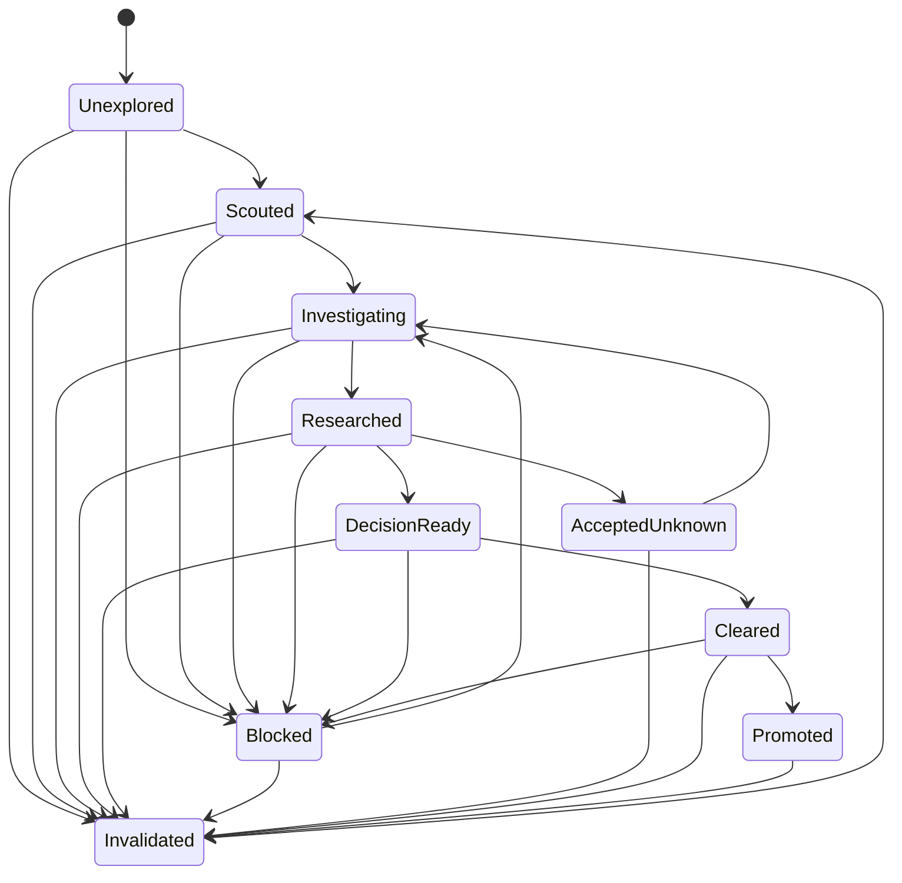

A node that had reached `decision-ready` or `cleared` moves to `blocked` when a
new dependency, a conflicted term, an unreachable anchor, or contradicting
evidence stops it from being settled. The block records its reason and the
blocking node or term; maturity is a separate axis, retained when the
understanding still holds and lowered one level when the evidence behind it was
withdrawn. Clearing the block returns the node to `investigating`, and it
re-earns `decision-ready` and `cleared` through the ordered states.

Reinterpretation against a changed anchor can move a node to `invalidated` from
any state, including `cleared` and `promoted`. A promoted node that is
invalidated keeps its tracker link and its promotion key and gains an explicit
divergence note for the user to resolve; the loop never silently unpublishes or
overwrites tracker content.

Each node also records its priority, evidence, requirements, decisions,
dependencies, verification seam, and the anchor revision against which it was
last interpreted.

## Adaptive Breadth and Depth

Breadth-first discovery is the default. It exposes the shape of the problem,
allows meaningful priority comparison, and avoids committing too early to one
branch.

The loop switches to bounded depth-first work when reinterpretation invalidates
or orphans a node, or when it detects priority debt, a shared blocker, high risk
or major uncertainty, or a branch that unlocks substantial downstream work.
Those five triggers are exactly selection rules 1 through 5; rule 6, the oldest
unresolved node, is the only rule that continues breadth.

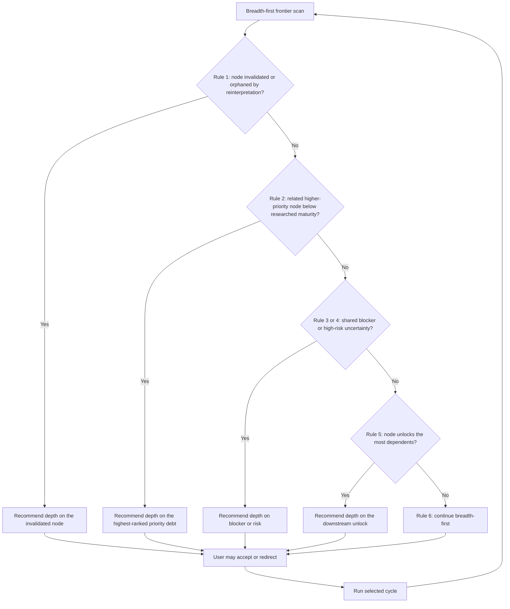

Priority and maturity are independent axes:

```text
Priority: unprioritized, P2, P1, P0
Maturity: vague, framed, researched, decision-ready, promotion-ready
```

Maturity means, in order:

- `vague` - a subject with no bounded outcome yet;
- `framed` - problem, outcome, actors, and obvious exclusions stated;
- `researched` - evidence, blockers, and next decisions known and recorded;
- `decision-ready` - every remaining choice stated with options and a
  recommendation, needing no further research;
- `promotion-ready` - decisions settled, requirements confirmed, dependencies
  typed, a verification seam named, and no conflicted term left.

A lower-priority branch must not continue gaining depth while a related
higher-priority branch remains below `researched` **maturity**. The researched
maturity floor means that the problem, intended outcome, evidence, blockers,
and next decisions are known. The higher-priority branch does not need to be
completely cleared before breadth-first work resumes.

At the beginning of each cycle, the loop states a parameterized recommendation
naming the selected nodes, the rule that chose them, and the reason:

- broad: "We're going to go broad on `<parent or sibling set>` first, covering
  `<node ids and titles>`, because `<selection rule and reason>`."
- deep: "I recommend we go deep on `<node id> - <title>` because
  `<selection rule and reason>`."

The user can redirect the selected branch or traversal mode. Otherwise, the
loop proceeds with its best recommendation, and any debt an override defers
stays recorded.

## Interrogation Groups

Every cycle focuses on one highest-value discovery item and asks questions one
at a time. Each question includes:

1. the recommended answer and a brief rationale;
2. one credible alternative and its tradeoff, or an explicit
   `none - <reason>` when no credible alternative exists;
3. freeform user entry.

The question-group size `N` is configurable per session and overridable per
invocation. The default is 12. The accepted range is 1 through 50 inclusive.
A value outside that range, or a non-integer, is rejected once with the
accepted range stated, and the cycle continues with the next value in the
precedence order: the session default, or the package default of 12 when the
session has none. An invocation override applies to the whole invocation and is
carried across each context reset, so later cycles in the same invocation keep
it.

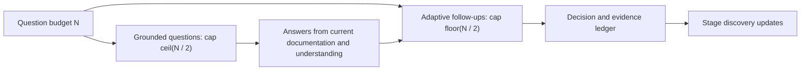

| Invocation | Grounded cap | Follow-up cap | Total cap |
| --- | ---: | ---: | ---: |
| `/discovery-loop in groups of 5` | 3 | 2 | 5 |
| Default session | 6 | 6 | 12 |
| `/discovery-loop in groups of 35` | 18 | 17 | 35 |

Every count in that table is a ceiling, never a quota. Question headers are
written `Q<n> of up to <N>` for the same reason. Grounded questions come
directly from the latest anchor, tree, domain model, requirements, evidence,
linked sessions, and promoted tickets. They are framed to clear known fog.

Follow-up questions adapt to the first-half answers. They clarify intent,
request details or source material, reconcile contradictions, and expose
constraints, dependencies, feasibility concerns, and verification needs.

Unused capacity is left unused and reported. Unused grounded capacity is never
converted into extra follow-ups, and unused follow-up capacity is never
converted into extra grounded questions.

A group ends at the first of: the total cap `N` reached, the material fog for
the selected item resolved, or the user stopping the group. When the group
ends, the loop records decisions and unresolved fog, stages the update,
persists a checkpoint, discards context, and restarts. It never exceeds `N` in
one cycle, and budgets never accumulate between cycles.

## Root Discovery Layer

The discovery workspace is grounded in one product, application, platform, or
system being built. Its primary mind map is the low-resolution model of that
whole product. Discovery sessions are focused vertical explorations beneath
that map. They clarify one product area deeply and feed their current
understanding back into the product-level view.

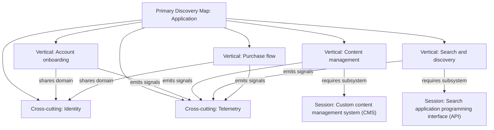

The primary map contains:

- the whole-product idea, Destination, and success conditions;
- major user and system verticals;
- cross-cutting domains and constraints;
- shared actors and canonical language;
- relationships and dependencies between verticals;
- each vertical's priority, maturity, active fog, and major blockers;
- links to the detailed discovery session for each explored vertical.

Each discovery session is anchored to one node or bounded branch of the primary
map. It owns the detailed tree, questions, requirements, evidence, domain
model, and backlog candidates for that vertical. Its persist step updates the
corresponding primary-map node with a compact status and summary.

Because several sessions share the primary map and the shared lexicon, the loop
treats those two root files as contended: it captures their digests when the
cycle opens, rereads them immediately before writing, and merges only its own
session's row and its own lexicon changes rather than rewriting the file it
read at cycle start. A concurrent change to somebody else's row is normal
traffic - the cycle rebases onto it and continues, and it never aborts over a
root change. Only a change to this session's own row or typed links, or to a
term this cycle also changed, is a conflict, and that goes to the user with
both states shown. After writing, the cycle verifies only what it owns there,
because unrelated rows may legitimately have changed again in the meantime.

Typed cross-session edges include:

- `requires-session`;
- `informs-session`;
- `conflicts-with-session`;
- `shares-domain-with`;
- `constrains-session`;
- `supersedes-session`;
- `related-session`.

The primary map is the entry point for deciding which vertical has the highest
discovery value. A session cycle loads the low-resolution product map and the
full current state of only the selected vertical. It reads linked session
summaries or specific nodes on demand rather than loading every detailed tree.

The direction of synthesis is bidirectional:

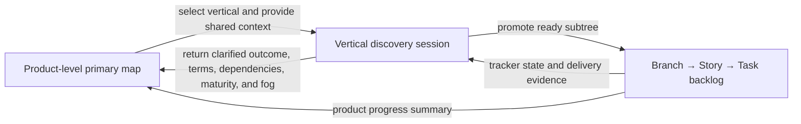

The primary map must remain concise. It tells the team what the application is,
which verticals exist, how they relate, and where fog remains. Detailed
requirements, interrogation history, research, and decomposition stay inside
the owning vertical session.

### Shared Domain Lexicon

The root discovery layer maintains a running tally of domain terms shared
across discovery efforts. Each session also maintains a scoped lexicon in its
own `discovery.md`. These compact lexicons are loaded before branch selection
and question generation so the loop remains crisp and consistent in its
language.

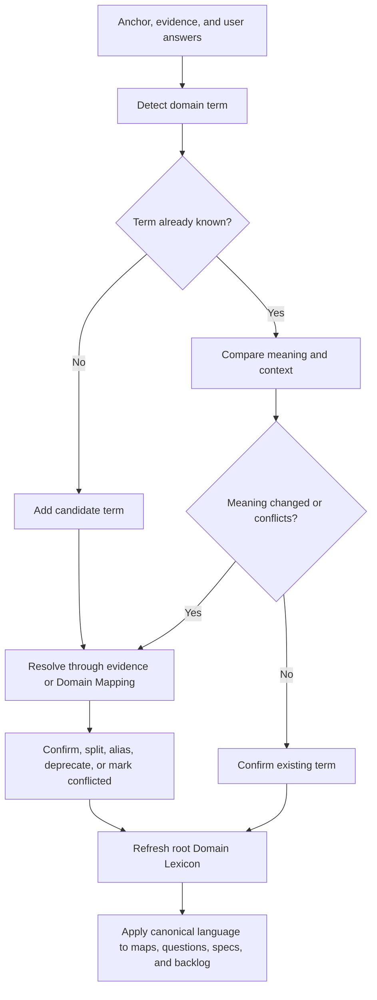

Each shared or session-scoped entry records:

| Field | Purpose |
| --- | --- |
| Term | Canonical spelling used by the session |
| Status | `candidate`, `confirmed`, `conflicted`, or `deprecated` |
| Definition | One concise, testable meaning |
| Bounded context | Where the definition applies |
| Aliases | Accepted synonyms and discouraged variants |
| Source | Evidence, decision, or domain artifact supporting the meaning |
| First seen | Session, node, and cycle that introduced the term |
| Last verified | Latest cycle that checked the term |
| Related terms | Parent, child, contrasting, or associated concepts |
| Scope | `shared` for the root lexicon, or `session:<slug>` for a session lexicon |

The shared root tally is a compact operating lexicon, not a replacement for a
session's `domain-model.md`. The domain model owns detailed actors, entities,
lifecycle, boundaries, ownership, and relationships. The root lexicon contains
only canonical terms needed across discovery efforts. A session lexicon
contains terms needed to interpret that session's detailed map consistently.

Ownership separates the *meaning* from the *file*. Domain Mapping owns confirmed
meaning and writes it into its own canonical repository artifacts - the owning
`CONTEXT.md`, a root `CONTEXT-MAP.md`, and approved Architecture Decision
Records at the locations named by `docs/agents/domain.md`. It never writes a
file inside the discovery package. Discovery Loop writes every file it owns,
including both sections of `domain-model.md` and both lexicons, and it may
record a term as `confirmed` only by mirroring an explicit Domain Mapping
result that names the artifact it wrote. The handoff runs after the cycle's
freshness check and before the promotion gate, and because it touches no
discovery file, the cycle's freshness baseline stays valid through persist.
At most one term is handed off per cycle, chosen deterministically - relevance
to the selected node first, then node priority, then dependency impact, then
the term itself - so the composed skill is never asked to settle a queue. Every
other material term is recorded with its own handoff key and waits for a later
cycle.
When Domain Mapping is unavailable, terms stay `candidate` or `conflicted`, the
pending handoff is recorded with its deterministic key, and promotion is blocked
only for nodes whose readiness actually depends on the unsettled meaning. The
cycle continues either way; a missing domain skill never aborts it and never
deadlocks unrelated promotion.

Every cycle must:

1. load the primary mind map, shared lexicon, and selected session lexicon
   before reading branch text;
2. detect undefined, overloaded, conflicting, or drifting language in the
   anchor, tree, evidence, and answers;
3. use existing confirmed terms in questions and recommendations;
4. add new language as `candidate`, never silently as confirmed;
5. hand a material vocabulary or boundary change to Domain Mapping after the
   freshness check, then mirror only its explicitly confirmed result;
6. propagate a confirmed rename or definition change to affected current-state
   artifacts while preserving historical wording in cycle checkpoints;
7. include unresolved terminology as fog that can block branch promotion;
8. refresh `Last verified` for every term the cycle actually used.

Terms first defined in one session retain their source-session identity. A term
used by multiple sessions is proposed for promotion into the shared lexicon. A
local session can adopt an alias or context-specific definition, but it must
record the distinction instead of silently redefining the shared term.

## Research and Prototypes

Before framing grounded questions, the loop inspects available evidence. For
the selected node, it distinguishes:

- facts answerable from repository or documentation evidence;
- user or product decisions;
- domain-modeling questions;
- technical feasibility research;
- questions requiring a bounded prototype;
- accepted unknowns.

Read-only research can run through bounded subagents. A prototype requires
explicit approval and must define a hypothesis, time or cost budget, a single
named isolation path, a cleanup plan that targets exactly that path, and an
evidence output. Prototype edits and prototype execution happen only inside
that path. Prototype work must not silently become production implementation,
and the loop does not implement production work under any other name.

## Multiple Discovery Sessions

One discovery session covers one anchored major idea. A workspace can contain
multiple sessions connected as a knowledge graph.

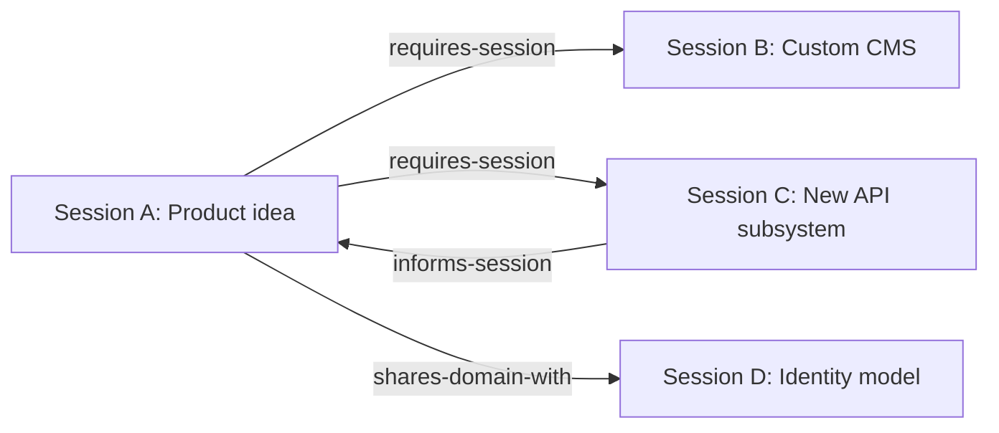

A branch is extracted into a separate session only when it represents a major
concept with an independent problem, outcome, domain, architecture surface,
multi-branch backlog, or delivery boundary. Examples include a custom content
management system (CMS) or a new application programming interface (API)
subsystem.

The loop proposes extraction and explains why. The user must approve it.
Ordinary features, requirements, and technical tasks remain in their parent
session. A cycle that read only part of the tree may propose an extraction but
never performs one: moving a branch means rewriting the parent, and a cycle
that did not load the whole tree cannot prove what still points at the branch.
It defers to a later full-state cycle, refuses outright when any affected node
is unread, and treats an approval given meanwhile as a standing intent rather
than a licence to move anything. The persist step is the one place a cycle writes into another
session's package, and it does so in a fixed order so a failure is always
recoverable: it creates the receiving package with the moved branch and
verifies it - writing nothing to the root files and removing nothing yet - then
writes and verifies the new primary-map row, the `supersedes-session` link and
its back-link, and the parent session's pointer, and only then removes the
branch from the parent and reverifies both packages. A failure at any point leaves the parent
intact - a duplicated but linked branch is recoverable, a prematurely deleted
one is not. An extracted node keeps its immutable promotion key even when the
receiving session has to assign it a new node id, and the old id is recorded on
the moved node.

## Session Package

The root discovery layer stores the primary mind map and shared lexicon. Each
session stores compact current state separately from immutable historical
checkpoints.

```text
docs/discovery/
├── discovery-map.md
├── domain-lexicon.md
└── sessions/
    └── <destination>/
        ├── discovery.md
        ├── domain-model.md
        ├── requirements.md
        ├── evidence.md
        └── cycles/
            ├── <cycle-id>.md
            ├── <cycle-id>.journal.md
            └── .pending/
                └── <cycle-id>.<run-id>.md
```

- `discovery-map.md` is the primary low-resolution mind map connecting all
  discovery sessions, their priorities, maturity, blockers, and typed links.
- `domain-lexicon.md` is the running tally of canonical terms shared across
  discovery sessions.
- `discovery.md` contains the anchor, current tree, active frontier, priorities,
  maturity, blockers, session-scoped Domain Lexicon, and tracker
  synchronization state.
- `domain-model.md` contains current vocabulary, actors, boundaries, ownership,
  lifecycle understanding, and detailed relationships behind the root lexicon.
  This loop writes the whole file: a confirmed section that mirrors explicit
  `/domain-mapping` results and cites the canonical artifact each came from,
  and a candidate section for everything not yet confirmed.
- `requirements.md` contains confirmed requirements, constraints, exclusions,
  and unresolved requirements.
- `evidence.md` indexes sources, research results, prototypes, limitations, and
  evidence digests.
- `cycles/<cycle-id>.md` is the published, immutable compressed checkpoint. It
  exists only after the state it describes has been written and verified.
- `cycles/.pending/<cycle-id>.<run-id>.md` is that checkpoint before
  publication. The cycle renders it, verifies it, and publishes it by an atomic
  rename; a candidate left behind by a failed run is reconciled at bind time
  and never published blindly.
- `cycles/<cycle-id>.journal.md` is the append-only working journal for the
  in-flight cycle. It is created when the cycle opens, before any traversal, and
  it is deleted only after the checkpoint and every other write is verified. It
  is what makes an interrupted cycle resumable without re-asking answered
  questions or recharging the question budget, and it records every tracker item
  the moment it is published so a crash mid-publication reconciles instead of
  duplicating.

The four current-state files are all required. If any of them cannot be read,
the cycle stops and reports a failed state rather than guessing, and a missing
package file is repaired only under an explicit approval.

Current-state files stay compact. A node's inline history is bounded and
compacted; the immutable cycle checkpoints hold the full provenance.

An alternate state root, such as the local-only Discovery fallback, is used
only when the user explicitly approves it with `Approve state root change`, or
when an existing composed-skill contract requires it. Changing how the session
talks to the tracker is a separate decision with its own approval,
`Approve tracker mode change`. An alternate root keeps the same layout beneath
it: root files at `<state-root>/discovery-map.md` and
`<state-root>/domain-lexicon.md`, and every package at
`<state-root>/sessions/<slug>/...`, with the same file names, semantics, and
digest-manifest paths.

If the session is anchored in another Markdown file, `discovery.md` links to
that file and records its current revision. Every cycle reinterprets the full
tree from the latest anchor content while preserving prior conclusions as
history. When the anchor or the tree is too large to read in full, the loop
reads the compact sections plus the selected branch, records the unread scope
as a stated limitation, and never claims a full reinterpretation it did not
perform.

A partial read constrains the *write* even more than it constrains the read.
The loop never re-renders the tree from a partial view, because doing so would
delete every node it did not load. It edits only the sections and node blocks
it actually read, records each unread node with its digest and length before
staging anything, and proves at persist time that every one of them is still
present and byte-identical. A missing or altered unread node is a failed state
with the journal retained and no checkpoint published - it is treated as data
loss, not as drift, because the loop itself is the only writer there.

The other three current-state files have no per-node boundaries the loop can
prove it holds, so they get a blunter rule: a `domain-model.md`,
`requirements.md`, or `evidence.md` that could only be read in part is
write-blocked for the whole cycle. Nothing is written to it, not even an
append, and every operation that would need to change it is refused with the
file named - a question whose answer belongs there, a confirmed domain mirror,
a promotion resting on an unread requirement. If every write of the cycle
targeted such a file, the cycle is simply read-only and the next full read
persists the work.

## Promotion into the Backlog

Markdown is the incubation layer. Speculative fog stays out of the ticketing
system. A ready subtree is promoted only after a complete preview and explicit
approval.

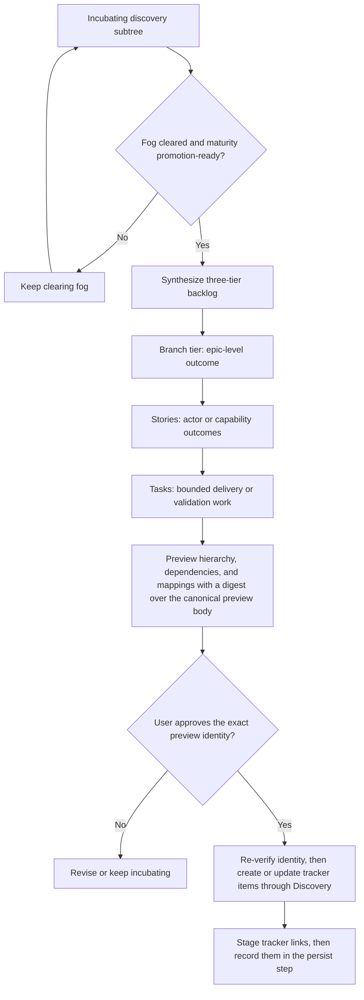

The canonical semantic hierarchy is:

```text
Branch
└── Story
    └── Task
```

These are semantic tiers, not hard-coded provider work-item types. The
repository tracker contract maps them to the available native hierarchy. The
Branch tier is the published top tier; it is not the same thing as a branch in
the discovery tree, which is a non-leaf node and its descendants. A subtree -
one branch node plus everything under it - is what the gate evaluates and the
preview publishes, and each leaf in it becomes a Story or a Task.

A promotion-ready leaf is at fog `cleared` **and** maturity `promotion-ready`,
and has:

- one bounded observable outcome;
- explicit scope and exclusions;
- actors and value;
- confirmed requirements and applicable non-functional constraints;
- priority and rationale;
- dependencies and blockers;
- a technical-feasibility disposition;
- evidence and accepted unknowns;
- a verification seam;
- enough clarity to create work without inventing facts.

The branch node of a promoted subtree is held to the same two axes: fog
`cleared` and maturity `promotion-ready`. There is no `decision-ready`
exception on either axis.

Deeper conceptual nodes are folded into branch or story context. Dependencies
remain explicit. Unresolved fog is never disguised as an implementation task.

Each promoted node carries an immutable promotion key so a later cycle updates
its tracker item instead of duplicating it, and so divergence between the node
and the tracker item can be detected and shown to the user. Every item is
recorded in the cycle journal as soon as the tracker confirms it, so an
interrupted publication is reconciled by that key - or, when the provider
cannot search by it, by the recorded item identity and parent hierarchy -
rather than published twice.

## Daily Repeatability

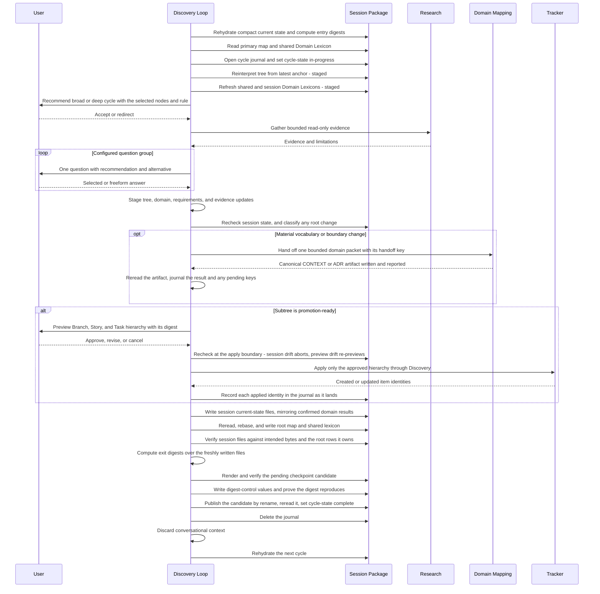

A daily pause completes the current persistence step, records incomplete
research and unanswered questions, saves priority debt and the deterministic
next frontier, and emits a concise resume instruction. Pausing a run does not
mean the discovery session is complete.

## Required Invariants

[Safeguards and recovery](./references/90-safeguards-and-recovery.md) holds the
single normative invariant list, the status model, the approval gate strings,
and the definition of `material`. It is the authority; this section only
describes what those invariants protect.

In summary, the loop guarantees:

- **Provenance** - every node traces to one anchor, every session appears once
  on the primary map, and cross-session relationships are typed.
- **Durable-state primacy** - each cycle rereads persisted state before acting
  and never treats conversation memory as canonical.
- **Bounded attention** - one question group per cycle, never exceeding its
  configured maximum, with budgets that never accumulate.
- **Ordered understanding** - lower-priority depth never outruns related
  higher-priority understanding.
- **User authority** - research never settles a user-owned decision, subagents
  never mutate state, and prototypes, extraction, state-root changes,
  tracker-mode changes, and publication each require their own exact approval.
- **Honest state** - unresolved fog is never presented as completed
  understanding, and history is append-only.
- **Verified persistence** - a checkpoint becomes immutable only by publication
  after the state it describes verifies, any failure before that publication
  leaves the journal and publishes nothing, a cycle that cannot detect drift is
  strictly read-only, a partial cycle preserves every node it did not load,
  never writes a partially read `domain-model.md`, `requirements.md`, or
  `evidence.md`, and never executes an extraction; deletion is limited to this
  loop's own verified journal, its own pending checkpoint candidate, and an
  approved prototype's exact isolation path.
- **Single writer** - no other skill writes a file inside the discovery
  package; Domain Mapping writes its own canonical domain artifacts and
  Discovery writes the tracker.
- **Stable attempts** - a cycle id pins its selected node, so a restart after
  drift reinterprets that node rather than quietly retargeting the answers the
  user already gave, and no approval or preview identity ever survives a
  context reset.

## Related Workflow Contracts

- [Skill entry point](./SKILL.md)
- [Composition and ownership](./references/10-composition-and-ownership.md)
- [Cycle workflow](./references/20-cycle-workflow.md)
- [Session package and state schema](./references/30-session-package-and-state.md)
- [Traversal, priority, and selection](./references/40-traversal-and-selection.md)
- [Interrogation groups](./references/50-interrogation-groups.md)
- [Domain Lexicon](./references/60-domain-lexicon.md)
- [Research and prototypes](./references/70-research-and-prototypes.md)
- [Promotion and tracker mapping](./references/80-promotion-and-tracker.md)
- [Safeguards and recovery](./references/90-safeguards-and-recovery.md)
- [Examples and scenario tests](./references/95-examples-and-scenario-tests.md)
